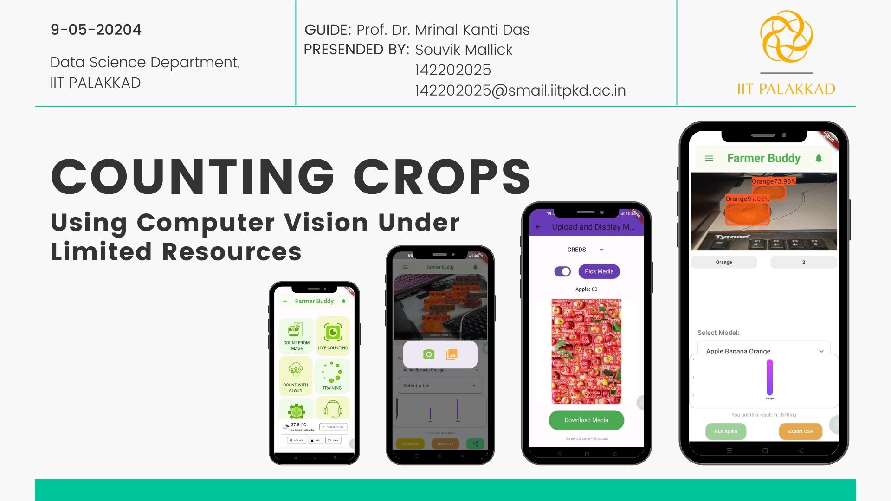
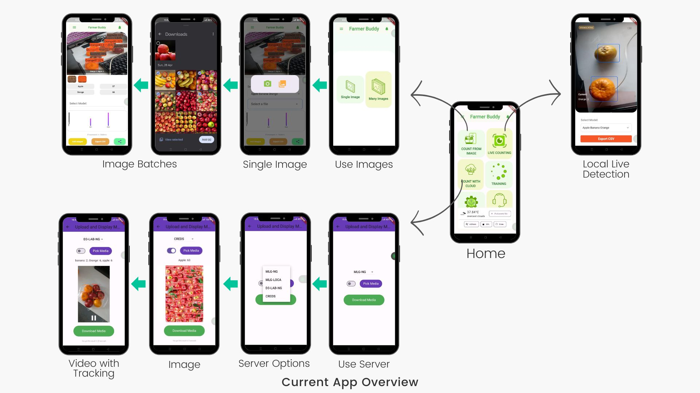

# Farmer Buddy | Ai Based Android App for Farmers

Farmer Buddy is a project I created at IIT Palakkad, as part of my M.tech project.

The goal of this project was to create an android app, that can run deeplearning models inside android devices locally, irrespective of hardware specifications of the device.

Deep learning models take a lot of harware resources to run, so the main challenge was to make the app run in majority android device.

This app works well with mobile phones with minimum 4-6 GB ram.

For even lower end devices, the app also has a server interface to access a model remotely over the indernate from a server.

This app also shows you visualizations of the class wise counted different crops via graphs.

I also lets you share share the count results using different apps like whatsapp, email etc.
You can also switch between different models for counting.

The app is also published in Google Playstore : https://play.google.com/store/apps/details?id=com.luphin.farmerbuddy&pcampaignid=web_share

## Screenshots

